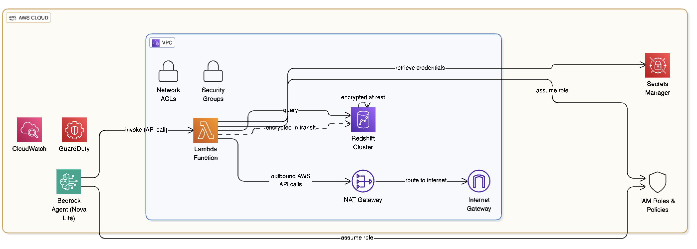

# Data Engineer On-Call AI Agent

An AI Agent that takes input as a Redshift table and checks if table statistics are up to date. If not, it can run ANALYZE to update statistics.

## Goal

Data Engineers on-call often get overwhelmed with performance issues from downstream BI tools or ETL delays. This agent helps Data Engineers on-call to fasten troubleshooting when managing Redshift data warehouse incidents. By automating table statistics checks and optimization, the agent reduces the time spent diagnosing performance bottlenecks and enables faster resolution of data pipeline issues.

### Natural Language Examples

The agent accepts natural language queries such as:
- "The sales_fact table is running slow, can you check if it needs optimization?"
- "Our ETL job for customer_data is taking too long, check table statistics"
- "Dashboard queries on product_inventory are timing out, analyze the table"
- "Check if user_events table needs ANALYZE command"
- "Performance issues with orders table, what's the stats_off value?"

## Architecture



### Network Flow:
1. **Bedrock Agent** receives natural language queries
2. **Lambda Function** runs in private subnet within VPC
3. **NAT Gateway** routes Lambda traffic to internet for AWS API calls
4. **Lambda** connects directly to **Redshift** within same VPC
5. **Secrets Manager** provides Redshift credentials securely

## Project Structure

```
DEAI/
├── src/
│   ├── config.py              # Configuration and AWS client setup
│   ├── lambda_function.py      # Lambda function for table metadata checking
│   ├── deploy.py              # Deployment script for all AWS resources
│   └── update_action_group.py # Script to update action group parameters
├── resources/
│   └── architecture.png       # Architecture diagram
├── test_agent.py              # Test script for the deployed agent
├── requirements.txt           # Python dependencies
└── README.md                 # This file
```

## Setup

1. Install dependencies:
   ```bash
   pip install -r requirements.txt
   ```

2. Configure AWS credentials:
   ```bash
   aws configure
   ```

3. Deploy the agent:
   ```bash
   python src/deploy.py
   ```

4. Test the agent:
   ```bash
   # Update agent_id and agent_alias_id in test_agent.py first
   python test_agent.py
   ```

## Components

### Lambda Function
- Connects to Redshift using credentials from AWS Secrets Manager
- Queries `svv_table_info` to check table statistics
- Returns metadata about table optimization status

### Bedrock Agent
- Uses Amazon Nova Lite model
- Configured with action group for table metadata checking
- Handles natural language queries about table statistics

### IAM Roles and Policies
- Lambda execution role with Redshift and Secrets Manager permissions
- Bedrock agent role with model invocation permissions

## Environment Variables

The Lambda function requires:
- `SecretId`: Name of the AWS Secrets Manager secret containing Redshift credentials

## Usage

Ask the agent questions like:
- "Check table metadata for employee_table"
- "What are the statistics for my_table?"
- "Is the table optimized?"

The agent will query Redshift and provide information about table statistics and optimization status.